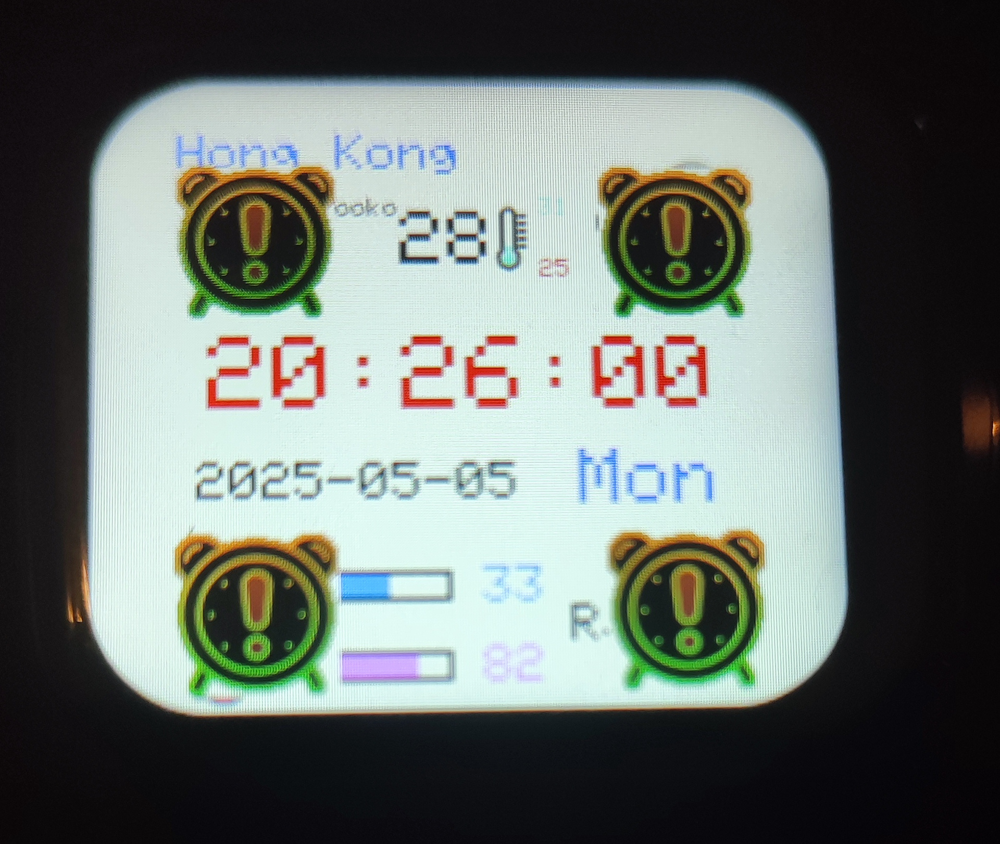
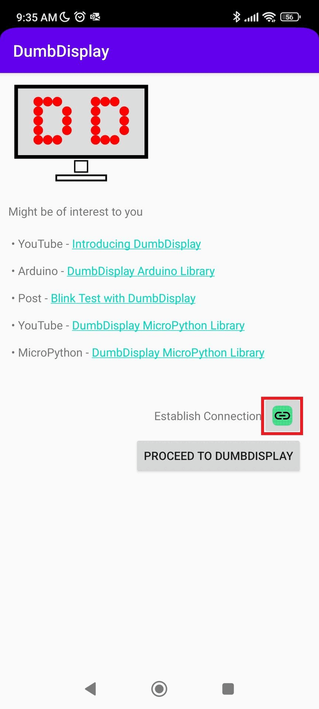
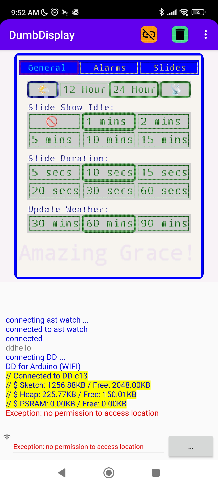
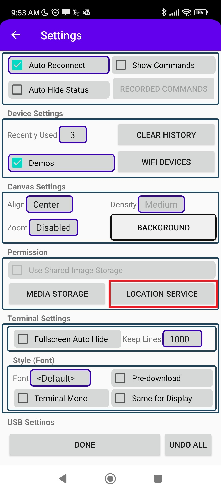
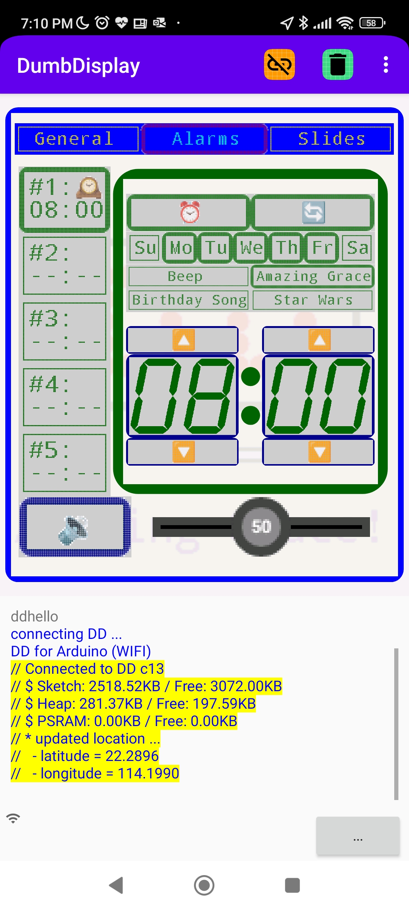

# Arduino Weather Clock -- `AWeatherClock` -- v1.1


This [little microcontroller project](https://github.com/trevorwslee/AWeatherClock) `AWeatherClock` (Arduino Weather Clock) was inspired by [pyClock](https://github.com/01studio-lab/pyClock), and is implemented using the Arduino framework.

VSCode with PlatformIO extension is the primarily development environment for the project, in the similar fashion as described by the post -- [A Way to Run Arduino Sketch With VSCode PlatformIO Directly](https://www.instructables.com/A-Way-to-Run-Arduino-Sketch-With-VSCode-PlatformIO/) 

|  |  |
|--|--|
|Naturally, the hardware used for the initial development of the project was exactly the one mention in the `pyClock` GitHub repository.|<div style='width:250px;height:250px'></div>|

Nevertheless, the sketch of `AWeatherClock` should be adaptable to other hardware configurations, with a big enough colored TFT LCD screen.

|  |  |  |  |  |
|--|--|--|--|--|
||||||

The functions of `AWeatherClock` are:
* Display of a digital clock synchronized with NTP
* Display of the current weather info gathered from [OpenWeather](https://home.openweathermap.org/) with ***version 2.5*** APIs [for [free account](https://openweathermap.org/full-price#onecall)]
* Alarms that can be repeated daily, with selectable days [of the week] for the repeat
* Idle slideshow of photos (JPEG images) uploaded to the MCU, much like the slideshow function as described by  [Simple Arduino Framework Raspberry Pi Pico / ESP32 TFT LCD Photo Frame Implementation With Photos Downloaded From the Internet Via DumbDisplay](https://www.instructables.com/Simple-Arduino-Framework-Raspberry-Pi-Pico-ESP32-T/)

`AWeatherClock` requires hardware with the following capabilities:
* ESP32 line of MCU that supports WiFi, or Raspberry Pi PicoW
* 240x240 (or bigger) colored TFT LCD screen
* Able to provide with simple "trigger" input, like with
  - `BUTTON` -- note that the "boot" button for ESP32 can be used as `BUTTON` here
  - `TOUCH SCREEN`
* Optionally -- buzzer, speaker or audio module (like ES8311 for ESP32) -- for sounding of alarms.

Since `AWeatherClock` needs to gather current weather info from [OpenWeather](https://home.openweathermap.org/users/sign_up),
please, ***sign up*** for an `APP_ID` of their ***version 2.5*** APIs. 
You will need this `APP_ID` in order to setup for `AWeatherClock` -- please refer to the section [Basic Hardcoded Configurations](#basic-hardcoded-configurations----configh)

Also, [DumbDisplay Android app](https://play.google.com/store/apps/details?id=nobody.trevorlee.dumbdisplay)
for Android phone (or Android simulator etc) is an essential part of `AWeatherClock` since most settings -- including alarm setups and slideshow photos upload -- can be done with remote UI realized on your Android phone with the help of DumbDisplay Android app
* Photos to upload can be acquired in the following ways:
  - randomly from the Internet
    * [picsum.photos](https://picsum.photos/)
    * [loremflickr.com](https://loremflickr.com/#google_vignette)
    * [placedog.net](https://placedog.net/)
  - randomly from [unsplash.com](https://unsplash.com/)
    * for downloading photos from [unsplash.com](https://unsplash.com/), you will need to [sign up](https://unsplash.com/developers) and create a demo app for an `Access Key` 
  - pick from your phone
  - take with your phone's camera  
* Location for weather info
  - according to hardcode query string (`DEF_OPEN_WEATHER_API_LOCATION` defined in `config.h`), or
  - based on GPS location of your phone queried via DumbDisplay Android app  
* NTP timezone
  - the initial timezone of your MCU is hardcoded to the macro `INIT_TIMEZONE` defined in `config.h`
  - after weather info gathering, timezone of your MCU is set to the timezone returned with the weather info
* When connected to DumbDisplay Android app, `AWeatherClock` is considered not idle, and hence slideshow will not start      

Notice that the remote UI on your Android phone is driven by the sketch -- i.e. the control flow of the UI is programmed in the sketch -- hence, other than the DumbDisplay Android app, there is no specific mobile app for `AWeatherClock`. 

You may want to refer to [Blink Test With Virtual Display, DumbDisplay](https://www.instructables.com/Blink-Test-With-Virtual-Display-DumbDisplay/)
for a bit more details about  [DumbDisplay Arduino library](https://github.com/trevorwslee/Arduino-DumbDisplay) and [DumbDisplay Android app](https://play.google.com/store/apps/details?id=nobody.trevorlee.dumbdisplay).

Concerning "sounding" of alarm. Actually `AWeatherClock` not only will flash the screen when alarm is due,
if buzzer / speaker / audio module (ES8311 for ESP32) is installed, audible alarm-specific sound will be generated.
Please refer to [Alarm Sound](#alarm-sound) for more details.


# Out-of-the-Box Supported Hardware

The sketch `arduino_weather_clock.ino` of this project is tailored for various compatible hardware that I can get hold of:
* PlatformIO env `PYCLOCK` -- ESP32 C3 [pyClock](https://github.com/01studio-lab/pyClock)
  - it's button on the back is configured as a `BUTTON` for "trigger" input
* PlatformIO env `AST_WATCH` -- ESP32 C3 [Astronaut-Clock-Watch (touch)](https://spotpear.cn/wiki/ESP32-C3-Ornament-Trinket-LVGL-Astronaut-Clock-Watch-MINI-TV-1.69inch-Round-LCD-TouchScreen-ST7789-240x280.html)
  - it's touch screen is configured as a `TOUCH SCREEN` for "trigger" input
  - it has a buzzer, which is used to generate alarm sound 
* PlatformIO env `TW3` -- ESP32 [LILYGO_WATCH_2020_V3](https://github.com/Xinyuan-LilyGO/TTGO_TWatch_Library)
  - it's touch screen is configured as a `TOUCH SCREEN` for "trigger" input 
* PlatformIO env `ESP_SPARKBOT` -- ESP32 S3 [ESP-SparkBot](https://oshwlab.com/hawaii0707/esp-sparkbot)
  - it's right side is touchable, which is configured as a `BUTTON` for "trigger" input, but from my experience, this "touch-pin" mechanism doesn't work very well 😞
  - it also has the `ES8311` audio codec module, which is used to generate alarm sound
* PlatformIO env `MUMA` (touch) / `MUMA_NT` (non-touch) -- ESP32 S3 [Little MuMa](https://spotpear.cn/shop/ESP32-S3-AI-1.54-inch-LCD-Display-TouchScreen-N16R8-muma-DeepSeek.html)
  - for touch version (`MUMA`), it's touch screen is configured as a `TOUCH SCREEN` for "trigger" input
  - for non-touch version (`MUMA_NT`), it's "boot" button on the back right side is configured as a `BUTTON` for "trigger" input
  - it also has the `ES8311` audio codec module, which is used to generate alarm sound
* Platformio env `PICOW_GP` -- a Raspberry Pi PicoW attached to a [gamepad-like LCD](https://spotpear.cn/wiki/Raspberry-Pi-Pico-RP2040-1.54inch-LCD-display-Screen-Game-ST7789.html)
  - the gamepad's "start" button is configured as a `BUTTON` for "trigger" input
* PlatformIO env `PICOW` -- the Raspberry Pi PicoW wiring as mentioned in [Simple Arduino Framework Raspberry Pi Pico / ESP32 TFT LCD Photo Frame Implementation With Photos Downloaded From the Internet Via DumbDisplay](https://www.instructables.com/Simple-Arduino-Framework-Raspberry-Pi-Pico-ESP32-T/)
  - a ST7789 2.8 inch 240x320 SPI TFT LCD module is used, with a FT6336U capacitive touch layer
  - it's touch screen is configured as a `TOUCH SCREEN` for "trigger" input 
  - a speaker is attached to it; the speaker is used to generate alarm sound 
  - for more details, please refer to the later section [Customizations for New Hardware PicoW Example](#customizations-for-new-hardware-picow-example)
* PlatformIO env `ESP32` -- an ESP32 customized hardware 
  - a ST7789V 1.3 inch 240x240 SPI TFT LCD module (ST7789) is used
  - a button is attached to it, as `BUTTON` for "trigger" input 
  - a speaker is attached to it; the speaker is used to generate alarm sound 
  - for more details, please refer to the later section [Customizations for New Hardware ESP32 Example](#customizations-for-new-hardware-esp32-example)

Notes:
* How many slides can be stored in the MCU? Say,
  - for `PYCLOCK` which is an ESP32-C3 with 4M of flash memory, I can store 25 to 30 photos to the flash of the MCU; note that for `PYCLOCK`, it is configured to use `no_ota.csv` partitions in `platformio.ini` like
    ```
    board_build.partitions = no_ota.csv
    ``` 
  - for Raspberry Pi Pico, I can also store 25 to 30 photos to the flash of the MCU as well; note that for Raspberry Pi Pico, `littlefs` is configured in `platformio.ini` like
    ```
    board_build.filesystem = littlefs
    board_build.filesystem_size = 1m
    ```
* For TWatch (`TW3`): If when compile you see some "include font" error, it might be that the project's folder path is too long.
  In such a case, try move the project to somewhere closer to the "root" of your filesystem 


# Showing of IP

With `BUTTON` or `TOUCH SCREEN`, you can trigger `AWeatherClock` to show the IP of your MCU to connect to with your Android DumbDisplay app

|  |  |
|--|--|
|Be the "trigger" mechanism `BUTTON` or `TOUCH SCREEN`, you "double click" to trigger showing of IP|<div style='width:250px;height:250px'></div>|


|  |  |
|--|--|
|You will need this IP to make connection between `AWeatherClock` and your Android phone's Arduino DumbDisplay app for the remote UI, as will be described in more details next|<div style='width:500px;height:800px'></div>|

|  |  |  |
|--|--|--|
|BTW. You might see that DumbDisplay Android app requires "LOCATION" permission to make use of your phone's GPS service. You can grant the permission with the `Settings` menu option of DumbDisplay Android app|<div style='width:280px;height:600px'></div>|<div style='width:280px;height:600px'></div>|


# Settings UI 

As mentioned previously, most of the `AWeatherClock` settings can be modified with the UI remotely rendered on your Android phone with DumbDisplay Android app


# Settings UI -- General

|  |  |
|--|--|
|With the `General` tab, you can modify the general settings / options|<div style='width:500px;height:800px'></div>|

* `🌤️` -- you click the `🌤️` button to trigger refresh of the current weather info
* `12 Hour` / `24 Hour` -- you select whether the digital clock display should be in 12-hour or 24-hour format
* `📡` -- you select whether to sync weather location with the GPS location of your phone
* `Slide Show Idle` -- you select the idle time (in minutes) before starting slideshow; to disable idle slideshow, select `🚫`
* `Slide Duration` -- you select the duration (in seconds) each slide should be kept shown, before switching to another one
* `Update Weather` -- you select the gap (in minutes) between each auto update of the current weather info


# Settings UI -- Alarms

|  |  |
|--|--|
|With the `Alarms` tab, you can set up the alarms of `AWeatherClock`|<div style='width:500px;height:800px'></div>|

* The `🕰️` icon next to an alarm indicates that the alarm is ON; below that icon, the time of the alarm is shown, like `00:00`
* You can select any one of the alarms to edit. The details of the alarm being edited are shown on the right-side
  - you can turn the alarm ON / OFF by selecting the `⏰` button
  - you select the `🔄` button to set that the alarm is to be repeated daily; and the week days for the repeat are indicated by the
    `Su` / `Mo` / `Tu` / `We` / `Th` / `Fr` / `Sa` below the `🔄` button
  - The time of the alarm is clearly shown further down below. You can press the `🔼` / `🔽` to have the alarm hour / minute changed. Alternatively, you can double-press 
    on the hour / minute to have a pop-up dialog for you to enter the hour / minute of the alarm.
    Note that if you enter a value bigger than `99`, like 1230, it will be interpreted as the time `12:30`;
    if you want to enter the time, say, `00:01`, enter `2401`    


# Settings UI -- Slides

|  |  |  |
|--|--|--|
||||


With the `Slides` tab, you can add / remove photos for the idle slideshow
* `⬅️` / `➡️` -- you use the `⬅️` / `➡️` buttons to review the slideshow photos
  - you select the photo to be deleted from the slideshow
  - newly uploaded photo can be saved to the slideshow after the photo selected
* `💾` / `🗑️` -- you delete the photo shown by double-pressing `🗑️`; the `💾` is for you to add the uploaded photo to the slideshow
* Acquire photo to upload:
  - `🌍` / `💦` -- you trigger download of a random photo from the Internet by pressing `🌍`; `💦` is specifically for downloading a random photo from Unsplash     
  - `📱` / `📷` -- you pick a photo from your phone by pressing `📱`; you take a photo with your phone's camera by pressing `📷`
  - In any case, the uploaded photo will be considered "unsaved"; you press `💾` to add the photo to the slideshow
  - Also notice for photo that might not fit `AWeatherClock` screen, a [crop UI](https://github.com/Yalantis/uCrop) will be invoked for you to crop the photo in order to fit the screen 
  

# Alarm Sound

As mentioned previously, in addition to flashing of the screen, in case of audible alarm sound can be generated with buzzer / speaker / audio module (ES8311 for ESP32), alarm-specific selection will be available
- `Beep` sound -- with buzzer / speaker / audio module 
- Melody `Amazing Grace` (for ESP32) -- similar to what described by the YouTube video [Raspberry Pi Pico playing song melody tones, with DumbDisplay control and keyboard input](https://www.youtube.com/watch?v=l-HrsJXIwBY)

- Melody `Birthday Song` (for ESP32) -- similar to above melody `Amazing Grace`, but musical notes generated with LLM
  `happy_birthday_melody.h`  
  ```
  I asked LLM to generate this file's "happy birthday" melody.

  Prompt:

  At the end are the data structures for the melody "amazing grace". Can you figure out the data for the melody "happy birthday"?

  IMPORTANT notes:
  * Each musical note MUST be composed of exactly two characters, no more and no less.
  * Hence, the data "nodenames" / "octaves" / "beats" for each musical note MUST be composed with two characters, and therefore might be padded with space " "
  * For "nodenames" -- e.g "C " for C; "C#" for C sharp; and "Cb" for C flat
  * For "octaves" -- e.g. "0 " for octave 0; "1 " for octave 1; "2 " for octave 2; note that it can be negative like "-1" (still TWO chars), for lower octaves

  -----------------

  const char* amazing_grace_nodenames = "G C E C E D C A G G C E C E D G E G E G E C G A C C A G G C E C E D C ";
  const char* amazing_grace_octaves   = "0 1 1 1 1 1 1 0 0 0 1 1 1 1 1 1 1 1 1 1 1 1 0 0 1 1 0 0 0 1 1 1 1 1 1 ";
  const char* amazing_grace_beats     = "2 4 1 1 4 2 4 2 4 2 4 1 1 4 2 8 2 1 1 1 1 4 2 4 1 1 1 4 2 4 1 1 4 2 8 ";

  const int amazing_grace_beatSpeed = 300;
  ``` 

- Music [sample] `Star Wars` (for ESP32 with audio module ES8311) -- music played with [Arduino Audio Tools](https://github.com/pschatzmann/arduino-audio-tools), with data file `star_wars_music.h`, which is actually the same data file used by the [`streams-memory_raw-i2s` example](https://github.com/pschatzmann/arduino-audio-tools/tree/main/examples/examples-stream/streams-memory_raw-i2s) 


Note that this per-alarm sound selection is only available for ESP32 line of MCU. Moreover, if your hardware has the audio module ES8311, you will have more
|  |  |
|--|--|
|Again, with the `Alarms` tab, you can select the per-alarm sound to alert you when the alarm is due|<div style='width:500px;height:800px'></div>|
Notes:
* The sound choice `Star Wars` is only available for the audio module ES8311
* Additionally, slider next to `🔊` allows you to change the ES8311 audio module volume
  


# Basic Hardcoded Configurations -- `config.h`

`config.h` for secrets like `WIFI_SSID`, `WIFI_PASSWORD` and `OPEN_WEATHER_MAP_APP_ID`
```
...
// #####
// # you will need to either
// # . enable and complete the following "secret" block
// # . or create and complete the "secret" block in the file `_secret.h`
// #####
#if false

  // ----------------------
  // !!! "secret" block !!!
  // ----------------------
  //
  // *****
  // * you can setup WIFI_SSID / WIFI_PASSWORD; for ESP32, if WIFI_SSID not defined, will use WiFiManager to get WiFi SSID and password
  // * you will need to setup OPEN_WEATHER_MAP_APP_ID
  // * you can optionally setup UNSPLASH_CLIENT_ID
  // *****

  #define WIFI_SSID               "<wifi ssid>"
  #define WIFI_PASSWORD           "<wifi password>"

  // you MUST get APP_ID from https://home.openweathermap.org/users/sign_up
  #define OPEN_WEATHER_MAP_APP_ID "<app id>"

  // optionally, sign up and create an app to get Access Key from https://unsplash.com/developers
  // comment out UNSPLASH_CLIENT_ID if you do not want to use unsplash.com
  #define UNSPLASH_CLIENT_ID      "<client id>"

#else
  #include "_secret.h"
#endif  
...
```
Notes:
* For ESP32 line of MCU, it is not a must to define `WIFI_SSID` / `WIFI_PASSWORD`. In case not defined, [WiFiManager](https://github.com/tzapu/WiFiManager) will be used to acquire the WiFi credential. Say, you connect to the AP set up by WiFiManager running on your MCU, with AP name `AWClock`, as defined by `AUTOCONNECT_AP_NAME` in `config.h`
* However, you ***MUST*** set your own `OPEN_WEATHER_MAP_APP_ID` for ***version 2.5*** APIs which you can apply for from [OpenWeather](https://home.openweathermap.org/users/sign_up),
  say with a [free account](https://openweathermap.org/full-price#onecall)
* Optionally, you can sign up and create an app to get Access Key from [Unsplash](https://unsplash.com/developers); with `UNSPLASH_CLIENT_ID` defined,
  your are ready to download photos from Unsplash and upload them to your MCU for slideshow


`config.h` for other basic hardcoded configurations
```
...
// TIMEZONE (in hours); note that NTP timezone will be gotten from weather api, hence, this is just the initial TIMEZONE
#define INIT_TIMEZONE                       8

// In order to properly setup the openweathermap.org the endpoint
// * please head to http://api.openweathermap.org to create an account and get an APP ID (for version 2.5) 
// * the country (location) for which to retrieve whether is defined with OPEN_WEATHER_API_LOCATION
//   - please refer to https://openweathermap.org/api/geocoding-api
//   - Please use ISO 3166 country codes -- https://en.wikipedia.org/wiki/List_of_ISO_3166_country_codes
// * below DEF_SYNC_WEATHER_LOCATION_WITH_GPS ==> got location from GPS when connected to DD
#define DEF_OPEN_WEATHER_API_LOCATION       "Hong Kong"

#define DEF_SYNC_WEATHER_LOCATION_WITH_GPS  true /* got location from GPS when connected to DD */
#define DEF_SLIDE_SHOW_IDLE_DELAY_MINS      2    /* <= 0 means slide show not enabled */
#define DEF_SLIDE_DURATION_SECS             5
#define DEF_UPDATE_WEATHER_INTERVAL_MINS    30

#define NUM_ALARMS                          5
#define AUTO_ACK_ALARM_MINUTES              10
...
```
Notes:
* `INIT_TIMEZONE` -- the initial timezone; as mentioned previously; your MCU's timezone will eventually sync with that returned from 'get current weather' API 
* `DEF_OPEN_WEATHER_API_LOCATION` -- the location (see [ISO 3166 country codes](https://en.wikipedia.org/wiki/List_of_ISO_3166_country_codes))
  for the initial current weather info; note that when connected to DumbDisplay Android app, your phone's GPS location can be the
  location for getting current weather info
* `DEF_SYNC_WEATHER_LOCATION_WITH_GPS` -- The default setting whether "get current weather" should be based on GPS location got from your phone,
  (rather than based on `DEF_OPEN_WEATHER_API_LOCATION`)
* `DEF_SLIDE_SHOW_IDLE_DELAY_MINS` -- The default setting for how many idle minutes to start slideshow  
* `DEF_SLIDE_DURATION_SECS` -- The default setting for how many seconds for each slideshow phone should stay displayed before switching to another one
* `DEF_UPDATE_WEATHER_INTERVAL_MINS` -- The default setting for the interval (minutes) between each update of current weather info
* `NUM_ALARMS` -- The fixed number of alarms `AWeatherClock` can set
* `AUTO_ACK_ALARM_MINUTES` -- The number of minutes before due alarm is automatically acknowledged (stopped)


# System Hardcoded Configurations -- `sys_config.h`

The system hardcoded configuration file `sys_config.h` not only contains most hardware pin mappings (as will be mentioned in the next section 
[Highlight for Customization for New Hardware](#highlight-for-customization-for-new-hardware));
specifically, `sys_config.h` contains some values that will be useful during development:
```
...
// comment out to DEBUG use of WIFI MANAGER for WiFi SSID / password
//#define TEST_WIFI_MANAGER

// comment out if you want the program to delay startup for 10 seconds for debugging (examine the serial monitor output)
//#define DELAY_INITIALIZE_FOR_SECONDS 10

// suggested to set the following EEPROM_HEADER to the date you want to reset the saved program settings *** INCLUDING saved slides ***
const int32_t EEPROM_HEADER = 20250505;
...
```


#  Customizations for New Hardware Highlights 

There are several areas to consider for customizing `AWeatherClock` for new hardware:
* `platformio.ini` for configuring PlatformIO for your MCU
* TFT LCD screen. The out-of-the-box configured TFT LCD screens are
  - ST7789 with [Adafruit ST7735 Library](https://github.com/adafruit/Adafruit-ST7735-Library.git)
  - ILI9341 with [Adafruit_ILI9341](https://github.com/adafruit/Adafruit_ILI9341)
  - LCD Screen of TWatch (`TW3`)
* Button or touch screen. For touch screen, the out-of-the-box configured touch screens are
  - FT6336U with [Arduino FT6336U](https://github.com/aselectroworks/Arduino-FT6336U)
  - CST816T with [cst816t](https://github.com/koendv/cst816t)
* Buzzer or audio module. For audio module, the out-of-the-box configured audio module is
  - ES8311 with [arduino audio driver](https://github.com/pschatzmann/arduino-audio-driver) and [arduino audio tools](https://github.com/pschatzmann/arduino-audio-tools)


For configuring PlatformIO for MCU. For example, for `PYCLOCK`, which is has an ESP32C3:
```
[env:PYCLOCK]
platform = espressif32
board = esp32-c3-devkitm-1
framework = arduino
board_build.partitions = no_ota.csv
lib_deps =
    https://github.com/adafruit/Adafruit-ST7735-Library.git
    https://github.com/adafruit/Adafruit-GFX-Library
    https://github.com/Bodmer/TJpg_Decoder.git
    https://github.com/bblanchon/ArduinoJson
    https://github.com/bitbank2/PNGdec#1.1.0
    https://github.com/tzapu/WiFiManager
    https://github.com/trevorwslee/Arduino-DumbDisplay
build_flags =
    -D ARDUINO_USB_MODE=1
    -D ARDUINO_USB_CDC_ON_BOOT=1
    -D FOR_PYCLOCK
```  
  - [`Adafruit-ST7735-Library`](https://github.com/adafruit/Adafruit-ST7735-Library) and
    [`Adafruit-GFX-Library`](https://github.com/adafruit/Adafruit-GFX-Library) for the ST7789 2.8 inch 240x320 SPI TFT LCD screen
  - [`TJpg_Decoder`](https://github.com/Bodmer/TJpg_Decoder) for decoding JPEG data (slides)
  - [`ArduinoJson`](https://github.com/bblanchon/ArduinoJson) for parsing the JSON got from OpenWeather
  - [`PNGdec`](https://github.com/bitbank2/PNGdec#1.1.0) for decoding the weather condition icon (PNG) retrieved from OpenWether
  - [`Arduino-DumbDisplay`](https://github.com/trevorwslee/Arduino-DumbDisplay) for driving DumbDisplay Android app for the UI remotely rendered with your Android phone

As for TFT LCD pin mappings (and others), they are mostly defined in `sys_config.h`.
For example, for `PYCLOCK`, which has a button
```
...
#if defined(FOR_PYCLOCK)
  #define TFT_CS          5
  #define TFT_DC          4
  #define TFT_SCLK        6
  #define TFT_MOSI        7
  #define TFT_RST         8
  #define TFT_X_OFF       0
  #define BUTTON_PIN      9
...
```
* `TFT_xxx` -- the pin mappings for the TFT LCD screen
* `TFT_X_OFF` -- the x offset to start the 240x240 area; note that the TFT screen can actually be wider than 240
* `BUTTON_PIN` -- the pin number of the button; assume it is `INPUT_PULLUP`

In case of CST816T touch screen, like that for `AST_WATCH`
```
...
#elif defined(FOR_AST_WATCH)
  #define TFT_CS          3
  #define TFT_DC          2
  #define TFT_SCLK        5
  #define TFT_MOSI        6
  #define TFT_RST         8
  #define TFT_X_OFF       20
  #define CST_TP_BUS_NUM  0
  #define CST_TP_SCL      7
  #define CST_TP_SDA      11
  #define CST_TP_RST      10
  #define CST_TP_INT      9
  #define BUZZER_PIN      1
...
```
* `TFT_xxx` -- the pin mappings for the TFT LCD screen
* `TFT_X_OFF` -- x offset is to 20, since the TFT LCD screen is 280x240
* `CST_TP_xxx` -- the pin mappings for the CST816T touch layer
* `BUZZER_PIN` -- the pin number of the buzzer

Nevertheless, especially for TFT LCD screen, simply define the pin mapping normally not good enough.
Indeed, you will need other customizations to the code, like initialization of `Adafruit_ST7789` object in `screen_helpers.cpp`
```
...
#if defined(FOR_PYCLOCK)
  #include <Adafruit_ST7789.h>
  SPIClass spi(FSPI);
  Adafruit_ST7789 tft(&spi, TFT_CS, TFT_DC, TFT_RST);
#elif defined(FOR_AST_WATCH)
  #include <Adafruit_ST7789.h>
  SPIClass spi(FSPI);
  Adafruit_ST7789 tft(&spi, TFT_CS, TFT_DC, TFT_RST);
#elif defined(FOR_PICOW_GP)
  #include <Adafruit_ST7789.h>
  Adafruit_ST7789 tft(&SPI1, TFT_CS, TFT_DC, TFT_RST);
#elif defined(FOR_PICOW)
  #include <Adafruit_ST7789.h>
  Adafruit_ST7789 tft(TFT_CS, TFT_DC, TFT_RST);
...
...
void screenSetup() {
#if defined(TFT_BL)
  pinMode(TFT_BL, OUTPUT);
  #if defined(TFT_BL_LOW)
  digitalWrite(TFT_BL, 0);  // light it up (LOW)
  #else
  digitalWrite(TFT_BL, 1);  // light it up
  #endif
#endif

#if defined(FOR_PYCLOCK)
  spi.begin(TFT_SCLK, -1, TFT_MOSI, TFT_CS);
  tft.init(240, 240, SPI_MODE0);
  tft.invertDisplay(true);
  tft.setRotation(2);
  tft.setSPISpeed(40000000);
#elif defined(FOR_AST_WATCH)  
  spi.begin(TFT_SCLK, -1, TFT_MOSI, TFT_CS);
  tft.init(240, 280, SPI_MODE0);
  tft.setRotation(3);
#elif defined(FOR_PICOW_GP)  
  SPI1.setSCK(TFT_SCLK);
  SPI1.setMOSI(TFT_MOSI);
  tft.init(240, 240, SPI_MODE0);
  tft.setRotation(3);
#elif defined(FOR_PICOW)  
  tft.init(240, 320, SPI_MODE0);
  tft.setRotation(1);
  tft.setSPISpeed(40000000);
  ...
}
...
```

Normally, customizing for `BUTTON` or `TOUCH SCREEN` code modifications should be easier, like in `trigger_helpers.cpp`:
```
...
#if defined(CST_TP_BUS_NUM)
  #include <Wire.h>
  #include "cst816t.h"
  TwoWire tpWire(CST_TP_BUS_NUM);
  cst816t touchpad(tpWire, CST_TP_RST, CST_TP_INT);
#elif defined(FT_TP_SCL)
  #include <Wire.h>
  #include "FT6336U.h"
  FT6336U touchpad(/*FT_TP_SDA, FT_TP_SCL, */FT_TP_RST, FT_TP_INT);
#elif defined(GT911_TP_SCL)  
  #include "TAMC_GT911.h"
  TAMC_GT911 touchpad = TAMC_GT911(GT911_TP_SDA, GT911_TP_SCL, GT911_TP_INT, GT911_TP_RST, GT911_TP_WIDTH, GT911_TP_HEIGHT);
...
void triggerSetup() {
#ifdef BUTTON_PIN
  pinMode(BUTTON_PIN, INPUT_PULLUP);  // assume INPUT_PULLUP
  attachInterrupt(digitalPinToInterrupt(BUTTON_PIN), _triggered, FALLING);
#elif defined(TOUCH_PIN)
  touchAttachInterrupt(TOUCH_PIN, _triggered, TOUCH_THRESHOLD);
#elif defined(CST_TP_BUS_NUM)
  tpWire.begin(CST_TP_SDA, CST_TP_SCL);
  touchpad.begin(mode_motion);
#elif defined(FT_TP_SCL)
  Wire.setSDA(FT_TP_SDA);            // FT6336U will use Wire
  Wire.setSCL(FT_TP_SCL);
  touchpad.begin();
  attachInterrupt(digitalPinToInterrupt(FT_TP_INT), _triggered, CHANGE);
  ...
}
...
```

As hinted above with `AST_WATCH`, to configure a buzzer / speaker is as easy as defining the pin assignment `BUZZER_PIN`.
However, there are much more pins for the ES8311 audio module, as in `ESP_SPARKBOT`
```
  #define ES8311_PA             46 
  #define ES8311_I2C_SCL        5
  #define ES8311_I2C_SDA        4
  #define ES8311_I2S_PORT       35
  #define ES8311_I2S_MCLK       45
  #define ES8311_I2S_BCK        39  
  #define ES8311_I2S_WS         41
  #define ES8311_I2S_DOUT       42
  #define ES8311_I2S_DIN        40
  #define DEF_AUDIO_VOLUME         60
```
* `DEF_AUDIO_VOLUME` sets the default volume of the audio module; set it if you want something different from the audio module default 

#  Customizations for New Hardware PicoW Example

Take the above-mentioned `PICOW` as an example -- the Raspberry Pi PicoW wiring as mentioned in [Simple Arduino Framework Raspberry Pi Pico / ESP32 TFT LCD Photo Frame Implementation With Photos Downloaded From the Internet Via DumbDisplay](https://www.instructables.com/Simple-Arduino-Framework-Raspberry-Pi-Pico-ESP32-T/)

- A ST7789 2.8 inch 240x320 SPI TFT LCD module is used, with a FT6336U capacitive touch layer
- It's touch screen is configured as a `TOUCH SCREEN` for "trigger" input 
- A speaker is attached to it -- one end of the speaker is connected to `GND` and the other end is connected to `GP15`

  |Raspberry Pi Pico|SPI TFT LCD |
  |-----------------|------------|
  | 3V3             | VCC        |
  | GND             | GND        |
  | GP21            | BL         |
  | GP17            | CS         |
  | GP16            | RS / DC    |
  | GP18            | CLK / SCLK |
  | GP19            | SDA / MOSI |
  | GP20            | RST        |
  | GP5             | TP_SCL     |
  | GP4             | TP_SDA     |
  | GP6             | TP_INT     |
  | GP7             | TP_RST     |
  | GP15            | SPEAKER    |
  | GND             | SPEAKER    |

`platformio.ini`
```
...
[env:PICOW]  ; ensure long file name support ... git config --system core.longpaths true
platform = https://github.com/maxgerhardt/platform-raspberrypi.git
board = rpipicow
framework = arduino
board_build.core = earlephilhower
board_build.filesystem = littlefs
board_build.filesystem_size = 1m
lib_deps =
    https://github.com/adafruit/Adafruit-ST7735-Library.git#1.11.0
    https://github.com/adafruit/Adafruit-GFX-Library#1.12.1
    https://github.com/Bodmer/TJpg_Decoder.git#V1.1.0 
    https://github.com/aselectroworks/Arduino-FT6336U
    https://github.com/bblanchon/ArduinoJson#v7.4.1
    https://github.com/bitbank2/PNGdec#1.1.0
    https://github.com/trevorwslee/Arduino-DumbDisplay#v0.9.9-r51
build_flags =
    -D FOR_PICOW
...    
```
* it appears that if using `earlephilhower` core in Windows, need to ensure long file name support ... ```git config --system core.longpaths true```
* there are quite a few libraries needed:
  - [`Adafruit-ST7735-Library`](https://github.com/adafruit/Adafruit-ST7735-Library) and
    [`Adafruit-GFX-Library`](https://github.com/adafruit/Adafruit-GFX-Library) for the ST7789 2.8 inch 240x320 SPI TFT LCD screen
  - [`TJpg_Decoder`](https://github.com/Bodmer/TJpg_Decoder) for decoding JPEG data (slides)
  - [`Arduino-FT6336U`](https://github.com/aselectroworks/Arduino-FT6336U) for the FT6336U touch layer 
  - [`ArduinoJson`](https://github.com/bblanchon/ArduinoJson) for parsing the JSON got from OpenWeather
  - [`PNGdec`](https://github.com/bitbank2/PNGdec) for decoding the weather condition icon (PNG) retrieved from OpenWether
  - [`Arduino-DumbDisplay`](https://github.com/trevorwslee/Arduino-DumbDisplay) for driving DumbDisplay Android app for the UI remotely rendered with your Android phone

`sys_config.h`
```
...
#elif defined(FOR_PICOW)
  #define TFT_BL      21
  #define TFT_CS      17
  #define TFT_DC      16
  #define TFT_SCLK    18
  #define TFT_MOSI    19
  #define TFT_RST     20
  #define TFT_X_OFF   40
  #define TFT_UN_INVERTED
  #define FT_TP_SCL   5 
  #define FT_TP_SDA   4
  #define FT_TP_INT   6
  #define FT_TP_RST   7
  #define BUZZER_PIN  15
...  
```
* `TFT_xxx` are the pin mappings of the ST7789 TFT LCD screen
* `TFT_X_OFF` is set to 40 since the screen is 320 wide and therefore need to offset the horizontal start by 40
* `TFT_UN_INVERTED` defines that the TFT LCD normally un-inverted; this macro tells the normal state of the TFT LCD when flashing the TFT LCD for due alarm
* `FT_TP_xxx` are the pin mappings of the FT6336U touch layer (normally part of the TFT LCD module)
* `BUZZER_PIN` is the pin connected to one end of the speaker attached to the PicoW; the other end can connect to `GND` of the PicoW

`screen_helpers.cpp`
```
...
#elif defined(FOR_PICOW)
  #include <Adafruit_ST7789.h>
  Adafruit_ST7789 tft(TFT_CS, TFT_DC, TFT_RST);
...
void screenSetup() {
#if defined(TFT_BL)
  pinMode(TFT_BL, OUTPUT);
  #if defined(TFT_BL_LOW)
    digitalWrite(TFT_BL, 0);  // light it up (LOW)
  #else
    digitalWrite(TFT_BL, 1);  // light it up
  #endif
#endif
  ...
#elif defined(FOR_PICOW)  
  tft.init(240, 320, SPI_MODE0);
  tft.invertDisplay(false);
  tft.setRotation(1);
  tft.setSPISpeed(40000000);
  ...
}
...
```
* the first `defined(FOR_PICOW)`
  - include the needed header file for the TFT LCD screen `<Adafruit_ST7789.h>`
  - instantiate the global variable `tft` (as the TFT LCD screen object)
* the second `defined(FOR_PICOW)`, which is inside the `void screenSetup()` block
  - run the necessary code to setup the TFT LCD screen -- `tft` declared previously


#  Customizations for New Hardware ESP32 Example

Take the above-mentioned `ESP32` as another example
- A ST7789 1.3 inch 240x240 SPI TFT LCD module is used
- A button is attached to it, which act as a `BUTTON` for "trigger" input -- one end of the button is connected to `GND` and the other end is connected to `GIPO26` 
- A speaker is attached to it -- one end of the speaker is connected to `GND` and the other end is connected to `GIPO23`

  |ESP32              |SPI TFT LCD |
  |-------------------|------------|
  | 3V3               | VCC        |
  | GND               | GND        |
  | GPIO18            | BL         |
  | GPIO15            | CS         |
  | GPIO2             | DC         |
  | GPIO14            | SCLK       |
  | GPIO13            | MOSI       |
  | GPIO4             | RST        |
  | GPIO26            | BUTTON     |
  | GND               | BUTTON     |
  | GPIO23            | SPEAKER    |
  | GND               | SPEAKER    |

`platformio.ini`
```
...
[env:ESP32]
platform = espressif32
board = esp32dev
framework = arduino
;board_build.partitions = huge_app.csv
;monitor_filters = esp32_exception_decoder
lib_deps =
    https://github.com/adafruit/Adafruit-ST7735-Library.git#1.11.0
    https://github.com/adafruit/Adafruit-GFX-Library#1.12.1
    https://github.com/Bodmer/TJpg_Decoder.git#V1.1.0 
    https://github.com/bblanchon/ArduinoJson#v7.4.1
    https://github.com/bitbank2/PNGdec#1.1.0
    https://github.com/tzapu/WiFiManager#v2.0.17
    https://github.com/trevorwslee/Arduino-DumbDisplay#v0.9.9-r51
build_flags =
    -D FOR_ESP32
...    
```
* it appears that if using `earlephilhower` core in Windows, need to ensure long file name support ... ```git config --system core.longpaths true```
* there are quite a few libraries needed:
  - [`Adafruit-ST7735-Library`](https://github.com/adafruit/Adafruit-ST7735-Library) and
    [`Adafruit-GFX-Library`](https://github.com/adafruit/Adafruit-GFX-Library) for the ST7789 1.3 inch 240x240 SPI TFT LCD screen
  - [`TJpg_Decoder`](https://github.com/Bodmer/TJpg_Decoder) for decoding JPEG data (slides)
  - [`ArduinoJson`](https://github.com/bblanchon/ArduinoJson) for parsing the JSON got from OpenWeather
  - [`PNGdec`](https://github.com/bitbank2/PNGdec) for decoding the weather condition icon (PNG) retrieved from OpenWether
  - [`WiFiManager`](https://github.com/tzapu/WiFiManager) for getting WiFi credential by setting up WiFi hotspot, when WiFi SSID / password not hard-coded
  - [`Arduino-DumbDisplay`](https://github.com/trevorwslee/Arduino-DumbDisplay) for driving DumbDisplay Android app for the UI remotely rendered with your Android phone
`sys_config.h`
```
...
#elif defined(FOR_ESP32)
  #define TFT_BL      18     
  #define TFT_CS      15
  #define TFT_DC      2
  #define TFT_SCLK    14
  #define TFT_MOSI    13
  #define TFT_RST     4
  #define TFT_X_OFF   0
  #define BUTTON_PIN  26    
  #define BUZZER_PIN  23
...  
```
* `TFT_xxx` are the pin mappings of the ST7789 TFT LCD screen
* `TFT_X_OFF` is set to 0 since the screen is 240 wide and therefore need no horizontal offset
* `BUTTON_PIN` is the pin connected to one end of the button attached to the ESP32; the other end can connect to `GND` of the ESP32
* `BUZZER_PIN` is the pin connected to one end of the speaker attached to the ESP32; the other end can connect to `GND` of the ESP32

`screen_helpers.cpp`
```
...
#elif defined(FOR_ESP32)
  #include <Adafruit_GFX.h>
  #include <Adafruit_ST7789.h>
  #include <SPI.h>   
  SPIClass spi = SPIClass(HSPI);
  Adafruit_ST7789 tft(&spi, TFT_CS, TFT_DC, TFT_RST);
...
void screenSetup() {
#if defined(TFT_BL)
  pinMode(TFT_BL, OUTPUT);
  #if defined(TFT_BL_LOW)
    digitalWrite(TFT_BL, 0);  // light it up (LOW)
  #else
    digitalWrite(TFT_BL, 1);  // light it up
  #endif
#endif
  ...
#elif defined(FOR_ESP32)  
  spi.begin(TFT_SCLK, -1, TFT_MOSI, TFT_CS);
  tft.setSPISpeed(40000000);
  tft.init(240, 240, SPI_MODE0);
  tft.setRotation(3);
  ...
}
...
```
* the first `defined(FOR_ESP32)`
  - include the needed header file for the TFT LCD screen `<Adafruit_ST7789.h>`
  - instantiate the global variable `tft` (as the TFT LCD screen object)
* the second `defined(FOR_ESP32)`, which is inside the `void screenSetup()` block
  - run the necessary code to setup the TFT LCD screen -- `tft` declared previously


Have fun with `AWeatherClock`!


# Enjoy!

> Peace be with you!
> May God bless you!
> Jesus loves you!
> Amazing Grace!


